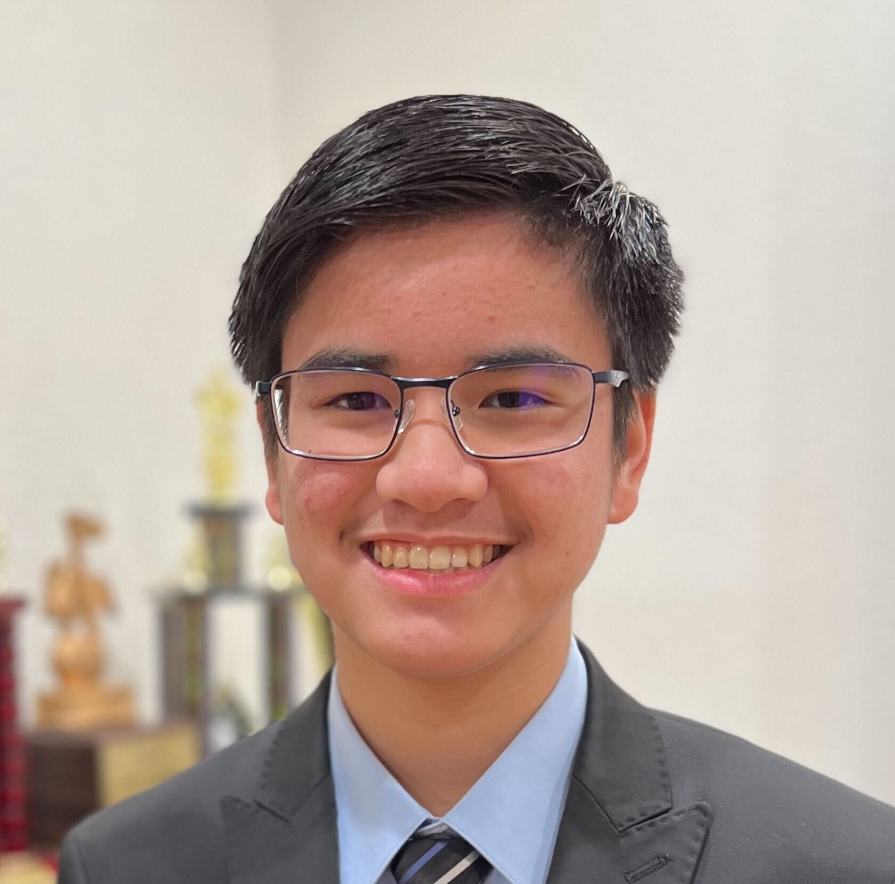
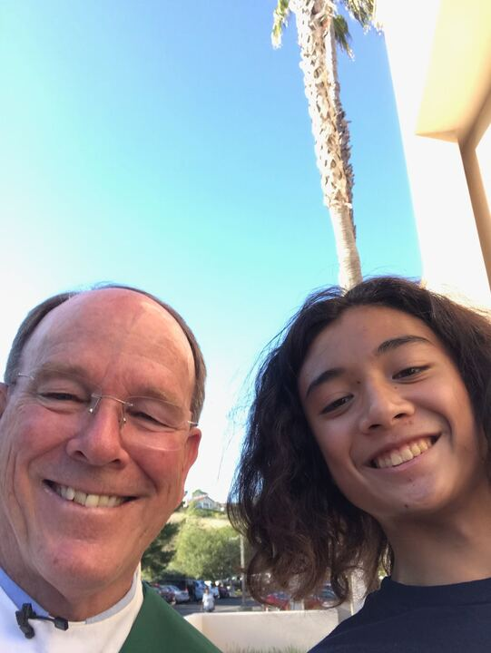
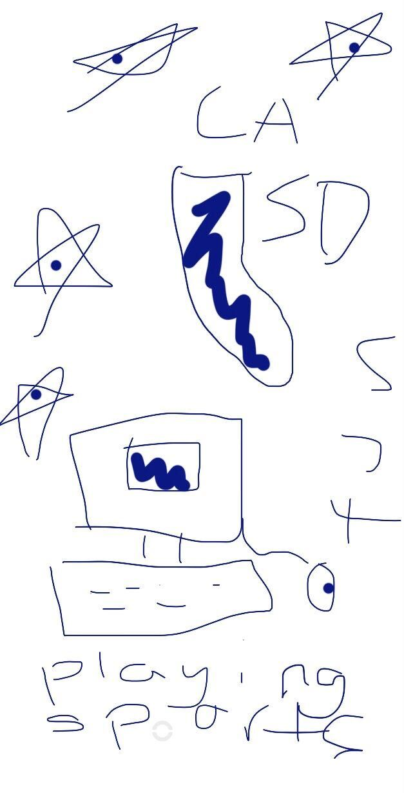

## Build your Home Page here 

    
    
    
Hello! My name is Matthew Borabo and I am very eager to be in Computer Science & Software Engineering! I am a junior at Del Norte High School and my favorite activity to do in my free time is to play the piano! I’ve played piano since I was around 7 years old (~10 years ago) and I am very involved in Cerificate of Merit, a music program that contains multiple levels of musical knowledge in theory and performance.

⠀

I am currently interested in the field of Computer Science, leading me to take Computer Science and Software Engineering (CSSE). Beforehand, I took Computer Animation 1-2 as a freshmen. Initially, I was thinking of becoming an electrical engineer (or the engineering field) when I was younger but now I am having trouble in picking one of the two fields. Both of these fields both have some math (and science) since I have a deep passion for math, in which I am currently taking Calculus 1.

 

 My classes are American Literature 1 with Mr. West, Calculus 1 with Ms. Hightower, CSSE with Mr. Lopez, Learning Strategies with Ms. Parmley, and AP Physics C: Mechanics with Mr. Eckman. 

My partner is Ian and I’ve known ever since we were in elementary school! His favorite sport is volleyball as it has many dynamics and strategies to the game! He is a sophomore and he plays a variety of video games such as Apex Legends, Valorant, and sometimes Pokemon. He is very friendly and kind, especially when I met him for the first time during my 2nd year of elementary school. I’m glad that he is my teammate for the entire trimester and I hope to know more about him during this course! :D 

Overall, I hope I will be able to get a good grade in this class, no matter how much time it takes. It may be a slow start to learn all about the terminal and basic coding fundamentals, but I will eventually be able to show that I am capable of being a good coder! :D

## Overview of Hacks, Study and Tangibles
Blogging in GitHub pages is a way to learn and code at the same time. 

- Plans, Lists, [Scrum Boards](https://clickup.com/blog/scrum-board/) help you to track key events, show progress and record time.  Effort is a big part of your class grade.  Show plans and time spent!
- [Hacks(Todo)](https://levelup.gitconnected.com/six-ultimate-daily-hacks-for-every-programmer-60f5f10feae) enable you to stay in focus with key requirements of the class.  Each Hack will produce Tangibles.
- Tangibles or [Tangible Artifacts](https://en.wikipedia.org/wiki/Artifact_(software_development)) are things you accumulate as a learner and coder. 
